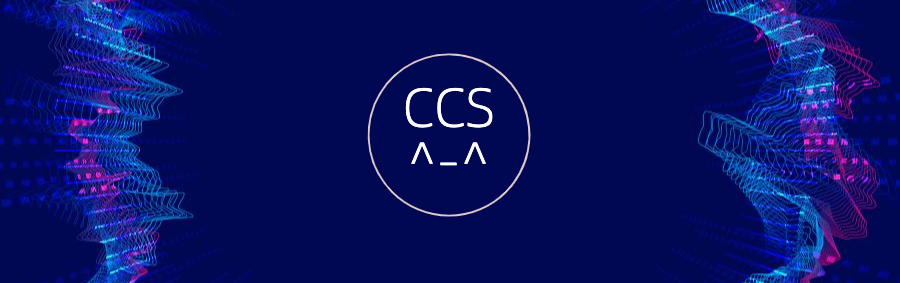

[logo](https://webbj97.github.io/Interesting-CSS/image/logo.png)

# 有趣的CSS和实用样式

CSS可以配合标签完成许多酷炫、神奇的效果，如果深入的研究，甚至可以成为前端开发进阶的一个主要方向。

所以我们从基础开始，逐渐去了解接触一些有趣的CSS效果（如果对您有帮助，不妨点下star～^～）

### 基础的CSS

### 选择器妙用
* :not(selector),选择非 <selector> 元素的每个元素。
  * 设置一组样式（最后一个元素除外） [:not selector](https://webbj97.github.io/Interesting-CSS/CSS3/selector/not.html)

### 圆角（border-radius）
[基础border-radius：常见的圆角](https://webbj97.github.io/Interesting-CSS/CSS3/radius/radius.html)  
[进阶border-radius：波浪效果](https://webbj97.github.io/Interesting-CSS/CSS3/radius/radius-wave.html)  
[进阶border-radius：旋转的radius](https://webbj97.github.io/Interesting-CSS/CSS3/radius/radius-rotote.html)  

### 阴影效果（box-shadows）
[单侧阴影](https://webbj97.github.io/Interesting-CSS/CSS3/shadow/one.html)  
[立体阴影](https://webbj97.github.io/Interesting-CSS/CSS3/shadow/two.html)  

### 过渡效果 (transition)
[hover态滑动出遮罩层](https://webbj97.github.io/Interesting-CSS/CSS3/transition/one.html)  
[bouncing-loader](https://webbj97.github.io/Interesting-CSS/CSS3/animation/loading/bouncing.html)  

### 渐变（linear-gradient）

[内容溢出-滚动渐变](https://webbj97.github.io/Interesting-CSS/CSS3/linear/overflow-scroll-gradient.html)  

---
未完待续
